# LCD Touch Screen

*Boot animation*

## Main panel

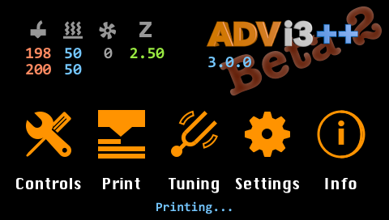

* **Temperatures**: Displays the current temperature of the extruder and of the bed. Displays also the current speed of the extruder's fan. Tap on this area to show a graph of temperatures.
* **Version**: Displays the version number of ADVi3++. Taps on this area to show an About panel with information about the release installed.
* **Controls**: Taps on this button to display the **Controls** panel with tools such as Load and Unload Filament, Move, etc.
* **Print**: Taps on this button to display the **Print** panel (if your are printing) or the Temperature graph (if you are not).
* **Measures**: Taps on this button to display the **Measures** panel with tools to help you adjust some parameters of your printer.
* **Settings**: Taps on this button to display the **Settings** panel. In this panel, you can view and modify several parameters of the printer.

## Controls

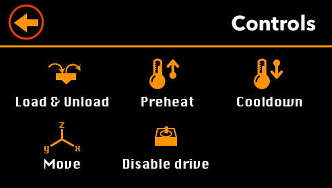

This panel gives you access to tools to control your printer.

* **Load & Unload**: Tools to Load or Unload Filament (see below).
* **Preheat**: Set of preheat settings (both Hot-end and Bed - see below).
* **Cooldown**: Disable both heated bed and Hot-end.
* **Move**: Tools to move the head of the printer, and to extrude or unextrude filament (see below).
* **Disable drive**: Disables all motors so you are able to move the head manually.

### Load & Unload

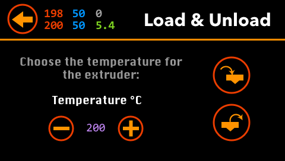

Select the extruder's target temperature you want to use (with the plus and minus buttons) and press either the **Load** or **Unload** button. 

**💡 Tip**: *Keep the button pressed to quickly increment or decrement the temperature.*

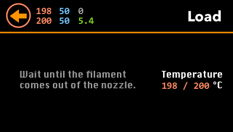

When the target temperature is almost reached, the extruder motor starts  extruding filament. When the filament comes out of the nozzle, press the **Back** button.

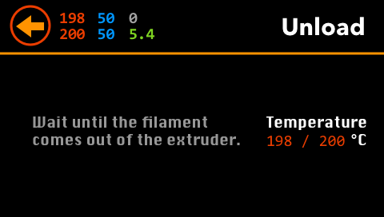

When the target temperature is almost reached, the extruder motor starts  unextruding filament. When the filament comes out of the extruder, press the **Back** button.

### Preheat

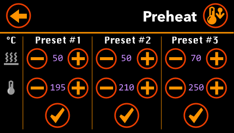

You have the choice of three presets (both bed and hot-end temperatures). You can adjust each value by pressing the plus and minus buttons. To start heating bed and hot-end, press one of the checkmark button. To stop heating, press the cooldown button on the top right corner.

**💡 Tip**: *Keep the button pressed to quickly increment or decrement a temperature.*

**⚠️ Important**: *If you press the __Back__ button, the printer continues to heat the bed and the hot-end. Press __Cooldown__ on this screen or on the __Tools__ screen to stop heating.*

### Move

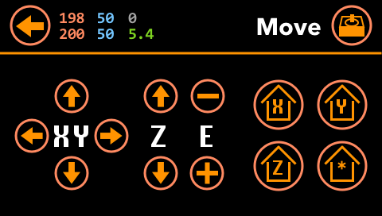

* You can move the head (X & Z) and the bed (Y) by pressing the buttons with arrows.

**💡 Tip**: *Keep the button pressed to quickly move the head or the bed.*

* Press the `E +` button to extrude some filament; press the `E -` button to un-extrude.

**⚠️ Important**: *The printer will extrude or un-extrude only if the temperature of the hot-end has reached a minimal value.*

* Press a button with a house icon to home the head (X & Z) or the bed (Y). Press the button with the star (*) to return both bed and hot-end to their home positions.

* Press the button with the motor icon (top-right corner) to disable all motors so they are free to move by hand.

## Print

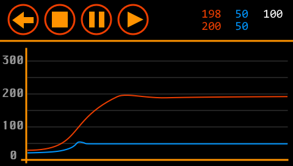

The exact screen displayed is dependent of the context (in this order):

* If you are printing from the SD card, the **SD Print** screen is displayed (see below).
* If you are printing through USB (i.e. from Cura, OctoPrint, ...), the **USB Print** screen is displayed (see below).
* If you are not printing and a SD card is inserted in the SD slot (and readable), the **SD Card** screen is displayed (see below).
* Otherwise, the **Temperature Graphs** is displayed (see below).

## SD Card

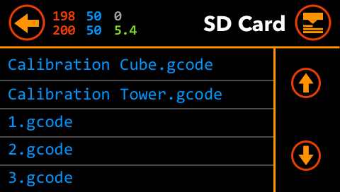

The **SD Card** screen is displayed only when a SD card is inserted in the SD slot of the printer and is readable. It displays all the files in the root of the SD card.

* If there are more than 5 files, use the two arrow button to display the files page per page.

* To print a file, press its name. The **SD Print** is displayed and the printing starts.

## SD Print

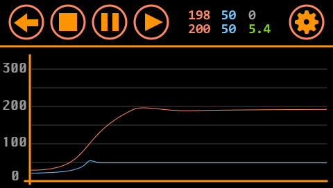

The **SD Print** screen is displayed only when a print is running from the SD card.

* It displays a graph of the temperatures (bed in blue, hot-end in red).
* **Stop**: Press the **Stop** button to stop the current printing. It also goes back to the previous screen (**SD Card**).
* **Pause**: Press the **Pause** button to temporary stop the printing.
* **Resume**: Press the **Resume** button to resume a paused printing.
* **Print Settings**: Press on the gear button to display and modify the **Print Settings** like the temperature, the fan speed, etc.
* **Back**: If you press the **Back** button, the printing continues and it goes back to the previous screen (**SD Card**).

## Print Settings

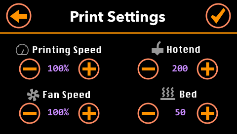

In this screen, you can adjust print parameters during a SD card printing:

* **Printing Speed**: The motor speed multiplier. Speed of motors is
multiplied by this rate.
* **Fan Speed**: The fan speed multiplier. Speed of the fan (in the front) is multiplied by this rate.
* **Hot-end**: Temperature of the hot-end.
* **Bed**: Temperature of the bed.

## USB Print

The **USB Print** screen is displayed only when a print is running through the USB cable (i.e. from Cura, OctoPrint, etc)

* It displays a graph of the temperatures (bed in blue, hot-end in red)
* **Stop**: Press the **Stop** button to stop the current printing. It also goes back to the previous screen.
* **Pause**: Press the **Pause** button to temporary stop the printing.
* **Resume**: Press the **Resume** button to resume a paused printing.
* **Print Settings**: Press on the gear button to display and modify the **Print Settings** like the temperature, the fan speed, etc.
* **Back**: If you press the **Back** button, the printing continues and it goes back to the previous screen.

## Measures

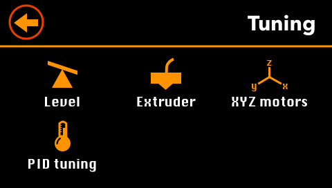

This panel gives you access to tools to help you adjust some parameters of your printer.

**⚠️ Important**: Some parameters are directly derived from the mechanical parts of the printer. Unless you change these parts (like the step motors), there is no need to change them.

* **Level**: Tool to help you level your bed.
* **Extruder**: Tool to help you adjust the number of steps per millimeter for the extruder motor.
* **XYZ motors**: Tool to help you adjust the number of steps per millimeter for X and Y motors.
* **PID tuning**: Tool to help you adjust the PID parameters ([proportional-integral-derivative control algorithm](http://reprap.org/wiki/PID_Tuning)).

## Level

This tool helps you level your bed.

* First, the head and bed return to their home position.

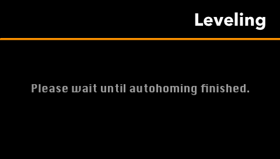

* Then, press one of the button with a number to go to each position:

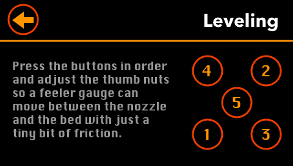

* Adjust each thumb nut so a feeler gauge (0.1 mm) can move between the nozzle and the bed with just a tiny bit of friction:

* If you do not have a feeler gauge, you can also use a sheet of paper but it is less accurate.

* Press the 5th button to check that your leveling is good. Press any of the other button to level again the corresponding corner.

* Once you are satisfied with the leveling, press the **Back** button.

**💡 Tip**: *A feeler gauge are cheap and you can buy one for a few dollars on Amazon, Banggood, etc. For example (randomly chosen items)*:

[amazon.com](https://www.amazon.com/Uxcell-Measure-Feeler-Blades-0-02mm/dp/B012FD5JLO/ref=pd_lpo_vtph_263_lp_t_2?_encoding=UTF8&psc=1&refRID=2Q4R5GBHAVB7SKVE2E5T)

[banggood.com](https://www.banggood.com/17pcs-Blade-Feeler-Gauge-Thickness-Gap-Metric-Measure-Tool-Set-0_02mm-to-1mm-p-1093020.html?rmmds=search&cur_warehouse=CN)

## Extruder

This tool helps you adjust adjust the number of steps per millimeter for the extruder motor. There is no need to do this more than once, except if you change some mechanical parts.

**⚠️ Important**: *This parameter (number of steps per millimeter) is directly derived from the mechanical parts of the printer (the step motor, the gear, ...) Unless you change these parts (like the gear), there is no need to change this parameter. Its default value is `400.5`.*

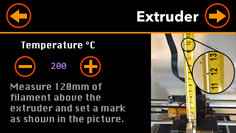

* Measures 120 mm of filament above the extruder and set, with a pen, a mark on the filament:

* Select the extruder's target temperature you want to use (with the plus and minus buttons) and press the arrow button (top-right corner). 

**💡 Tip**: *Keep the button pressed to quickly increment or decrement the temperature.*

* The printer starts heating the hot-end and when the target temperature is reached, it extrudes 100 mm of filament.

* Once the extrusion is finished (it takes around a minute), measures the filament remaining between the extruder and your mark:

* Enter the value in mm:

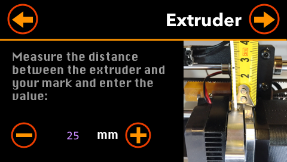

**💡 Tip**: *Keep the button pressed to quickly increment or decrement the value.*

* The computed value (E) is displayed and you can adjust it manually if you want:

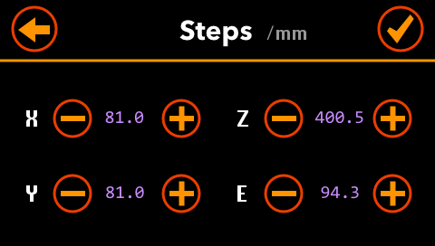

* Press the **Back** button the restart the process, or on the **Checkmark** button to save the settings. They are saved in the EEPROM memory of the motherboard.

## XYZ motors

This tool helps you adjust adjust the number of steps per millimeter for the X, Y and Z motors. There is no need to do this more than once, except if you change some mechanical parts.

**⚠️ Important**: *These parameters (number of steps per millimeter) are directly derived from the mechanical parts of the printer (the step motor, ...) Unless you change these parts (like the motors), there is no need to change this parameter. The default values are `81`, `81`, and `400.5`.*

* Print a cube 20x20x20 mm  and enter it actual dimensions (make more than one measure for each side and take the average):

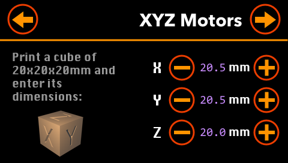

* The computed values (X, Y and Z) are displayed and you can adjust them manually if you want:

* Press the **Back** button the restart the process, or on the **Checkmark** button to save the settings. They are saved in the EEPROM memory of the motherboard.

**💡 Tips**: *There are several calibration cubes on [Thingiverse](https://www.thingiverse.com). For example:*

[XYZ 20mm Calibration Cube by iDig3Dprinting](https://www.thingiverse.com/thing:1278865)

*Measure X*

*Measure Y*

*Measure Z*

## PID tuning

> PID tuning refers to the parameters adjustment of a proportional-integral-derivative control algorithm used in most repraps for hot ends and heated beds.

[RepRap web site](http://reprap.org/wiki/PID_Tuning)

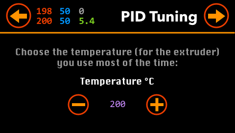

* Select the extruder's target temperature you want to use (with the plus and minus buttons) and press the arrow button (top-right corner). 

**💡 Tip**: *Keep the button pressed to quickly increment or decrement the temperature.*

* The PID tuning process starts. The printer increase and decrease the temperature of the hot-end around the target value:

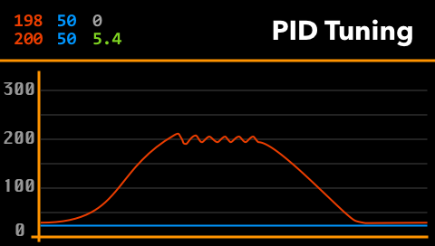

* When the PID tuning is finished (after some minutes), the new PID values are displayed:

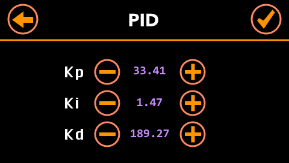

* Press the **Back** button the restart the process, or on the **Checkmark** button to save the settings. They are saved in the EEPROM memory of the motherboard.

## Settings

* **Motors**: Displays several settings related to the step motors (see bellow).
* **PID**: Displays the current PID settings.
* **Statistics**: Displays printing statistics.
* **Factory Reset**: Resets the various settings to their default values.
* **About**: Displays information about the different software components.

## Motors

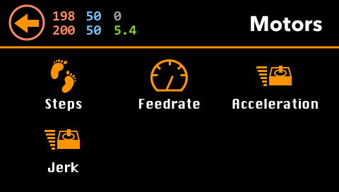

* **Steps**: Displays step settings of the motors.
* **Feedrate**: Display feedrate (speed) settings of the motors.
* **Acceleration**: Displays acceleration settings of the motors.
* **Jerk**: Displays jerk settings of the motors.

## Steps

This screen display the step settings of the motors.

* To adjust them manually, press the minus or plus buttons.

**💡 Tip**: *Keep the button pressed to quickly increment or decrement the temperature.*

* To save them, press the **Checkmark** button. The settings are saved in the EEPROM memory of the motherboard.

* The cancel any changes, press the **Back** button. It goes back to the previous screen.

## Feedrate

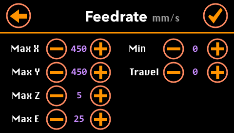

This screen display the feedrate (speed) settings of the motors.

* To adjust them manually, press the minus or plus buttons.

**💡 Tip**: *Keep the button pressed to quickly increment or decrement the temperature.*

* To save them, press the **Checkmark** button. The settings are saved in the EEPROM memory of the motherboard.

* The cancel any changes, press the **Back** button. It goes back to the previous screen.

## Acceleration

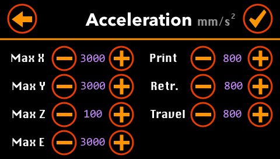

This screen display the acceleration settings of the motors.

* To adjust them manually, press the minus or plus buttons.

**💡 Tip**: *Keep the button pressed to quickly increment or decrement the temperature.*

* To save them, press the **Checkmark** button. The settings are saved in the EEPROM memory of the motherboard.

* The cancel any changes, press the **Back** button. It goes back to the previous screen.

## Jerk

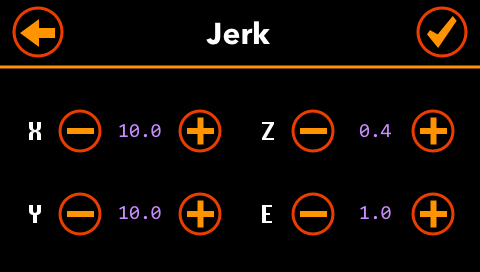

This screen display the jerk settings of the motors. The (maximum) jerks are the instantaneous change of speed that can be made. In other words, it is the (maximum( speed that the printer will immediately jump to before taking acceleration into account.

* To adjust them manually, press the minus or plus buttons.

**💡 Tip**: *Keep the button pressed to quickly increment or decrement the temperature.*

* To save them, press the **Checkmark** button. The settings are saved in the EEPROM memory of the motherboard.

* The cancel any changes, press the **Back** button. It goes back to the previous screen.
 
# PID

> PID tuning refers to the parameters adjustment of a proportional-integral-derivative control algorithm used in most repraps for hot ends and heated beds.

[RepRap web site](http://reprap.org/wiki/PID_Tuning)

This screen display the jerk settings of the motors. The (maximum) jerks are the instantaneous change of speed that can be made. In other words, it is the (maximum( speed that the printer will immediately jump to before taking acceleration into account.

* To adjust the PID settings manually, press the minus or plus buttons.

**💡 Tip**: *Keep the button pressed to quickly increment or decrement the temperature.*

* To save them, press the **Checkmark** button. The settings are saved in the EEPROM memory of the motherboard.

* The cancel any changes, press the **Back** button. It goes back to the previous screen.

## Statistics

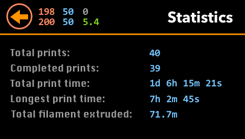

This screen display various statistics:

* **Total prints**: The number of prints send to the printer.
* **Completed prints**: The number of prints completed.
* **Total print time**: The total time spend on printing.
* **Longest print time**: The longest print.
* **Total filament extruded**: The total number of meters of filament extruded.

## Factory Reset

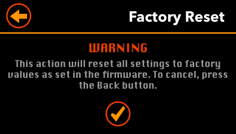

* Before resetting all the settings to their default, you have to confirm it by pressing the **Checkmark* button.

* If you do not want to reset the settings, press the **Back** button.

Once confirmed, all settings are reset to their default and save in the EEPROM memory of the motherboard.

## About

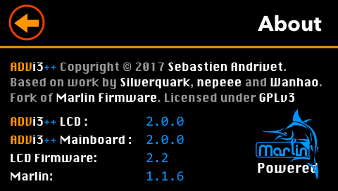

This screen display the version of several software components:

* **ADVi3++ LCD**: The version of the LCD part of **ADVi3++**.
* **ADVi3++ Motherboard**: The version of the Motherboard part of **ADVi3++**.
* **LCD firmware**: The version of the (internal) LCD touch screen display.
* **Marlin**: The version of the [Marlin](http://marlinfw.org) sources used by **ADVi3++**.

## Temperature graph

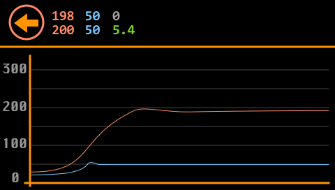

This screen displays a graph of the temperatures (bed in blue, hot-end in red).

* Press the **Back** button to go back to the previous screen.

