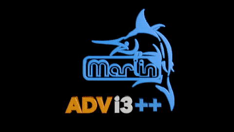

# ADVi3++ User Manual
Version 3.0.2 - June 6, 2018

## Table of content

* Introduction
* [How to Flash](How-to-Flash.md)
* [LCD Touch Screen Manual](LCD-Touch-Screen-Manual.md)
* [BLTouch Sensor](BLTouch.md)
* [Tuning](Tuning.md)
* [Default Configuration](Default-Configuration.md)
* [Building from the Source](Building.md)
* [Resources](Resources.md)

# Introduction

**ADVi3++** is a custom firmware for **Wanaho** Duplicator i3+ printers (and their clones like the Monoprice Select Plus). It is based on the latest stable release of Marlin and adds some new specific features. It has the following features when compared to the stock Wanhao firmwares:

* Based on **Marlin 1.1.8** (stock Wanhao firmwares are based on Marlin 1.1.4)
* New redesigned LCD screens
* Access on the LCD display to more printer parameters like Feedrate, Acceleration and Jerk settings
* Tuning of the X, Y, and Z motors as well as the extruder motor
* Temperature graphs
* 3 preheat presets
* 5 points manual bed leveling
* BLTouch support with automatic bed leveling
* Display of messages (M117 code) from external software such as OctoPrint (Detailed progress plugin for example)
* Advanced Pause (M600 support)
* An up to date User Manual

## Compatibility

Currently, **ADVi3++** is only compatible with the Wanhao Duplicator i3 Plus version 1 printer and its clones. Version 2 (aka Wanhao Duplicator i3 Plus **Mark II**) will be supported in a future release.

**ADVi3++** is not compatible with printers that do not have a similar LCD panel (DGUS DWIN), i.e. it is not compatible with previous versions of Duplicator i3, i3 Mini, etc.

## Source Code

The full source code of **ADVi3++** is available in the following GitHub repositories:

* [ADVi3pp-Marlin](https://github.com/andrivet/ADVi3pp-Marlin)
* [ADVi3pp-LCD](https://github.com/andrivet/ADVi3pp-LCD)
* [ADVi3pp-User-Manual](https://github.com/andrivet/ADVi3pp-User-Manual)

## Disclaimers

I am not affiliated, associated, authorized, endorsed by, or in any way officially connected with **Wanaho**, or any of its subsidiaries or its affiliates.

**USE THIS CUSTOM FIRMWARE AT YOUR OWN RISK. I am not responsible for any damage done to your printer or LCD when using this firmware.**

Be also aware that installing a third-party firmware like **ADVi3++** will probably **void** your **warranty** depending of your country.

## Copyrights

**ADVi3++**

* Copyright &copy; 2017-2018 Sebastien Andrivet [GitHub ADVi3pp-Marlin project](https://github.com/andrivet/advi3pp-Marlin])
* Copyright &copy; 2016-2018 [MarlinFirmware](https://github.com/MarlinFirmware/Marlin)
* Based on Sprinter and grbl.
* Copyright &copy; 2011 Camiel Gubbels / Erik van der Zalm

**ADVi3++ User Manual**

* Copyright &copy; 2018 Sebastien Andrivet

## Thanks

Thanks to [Dylan xKoldx](https://github.com/xKoldx/ADVi3pp-Marlin) and [weidercs](https://github.com/weidercs/ADVi3pp-Marlin) for their forks supporting BLTouch. Thanks to Matt Cowell [SureshotM6](https://github.com/SureshotM6/ADVi3pp-Marlin) for the fork supporting M600 and head parking.

Thanks you to Leo Lüker (Silverquark) for his [i3plus+ project](https://github.com/Silverquark/i3PlusPlus). I take many ideas from his code. But the project is no more active and I do not like the screens (personal taste) so I have created the **ADVi3++** fork. It is technically a fork of Marlin, not of i3plus+.

Thanks to [MarlinTeam](http://marlinfw.org/) for their great work.

## Licenses

**ADVi3++**

> This program is free software: you can redistribute it and/or modify it under the terms of the GNU General Public License as published by the Free Software Foundation, either version 3 of the License, or (at your option) any later version.

> This program is distributed in the hope that it will be useful, but WITHOUT ANY WARRANTY; without even the implied warranty of MERCHANTABILITY or FITNESS FOR A PARTICULAR PURPOSE.  See the GNU General Public License for more details.

> You should have received a copy of the GNU General Public License along with this program. If not, see <http://www.gnu.org/licenses/>.

**ADVi3++ User Manual**

 This manual is licensed under a <a rel="license" href="http://creativecommons.org/licenses/by-sa/4.0/">Creative Commons Attribution-ShareAlike 4.0 International License</a>.

